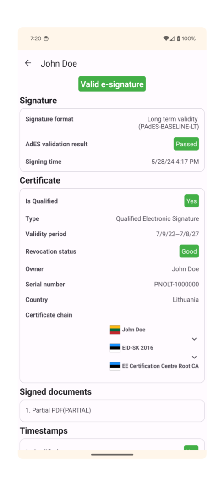
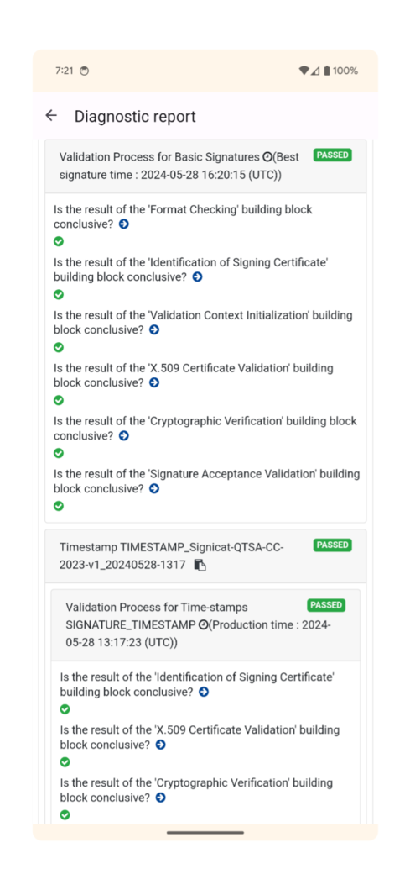

# Digital Signature on Android
### [Digital Signature Service (DSS)](https://github.com/esig/dss) 5.12.RC1 library port for android


[](https://github.com/signerry/dss-android/actions/workflows/unit-ci.yml)
[](https://github.com/signerry/dss-android/actions/workflows/android-ci.yml)

### Supported API Levels

Compatible with Android 8.0 (API level 26) to Android 13 (API level 33)

### Features
Fully supports validation and signing for the following formats:

1. **ASiC-E with CAdES**
2. **ASiC-E with XAdES**
3. **PAdES**

--- 

### Integration
To include this port in your project, add the following to your `build.gradle` file:

```groovy
repositories {
   maven {
      url = uri("https://maven.pkg.github.com/signerry/packages")
      credentials {
         username = System.getenv("GPR_USER")
         password = System.getenv("GPR_API_KEY")
      }
   }
}

dependencies {
    api "com.signerry.dss-android:dss-xades:1.01.20"
    api "com.signerry.dss-android:dss-asic-common:1.01.20"
    api "com.signerry.dss-android:dss-asic-xades:1.01.20"
    api "com.signerry.dss-android:dss-asic-cades:1.01.20"
}
```

--- 

### Known Issues
All stock DSS tests pass with a few exceptions, mostly related to visual signatures. The following tests are not passing
and have been disabled:

1. **dss-xades**:
   - XAdESLevelBEnvelopingManifestReferenceCanonicalizationTest 
   - XAdESLevelBReSignOJManifestTest
2. **dss-pades-pdfbox**:
    - Visual textFullyTransparentTest
    - Visual multilinesWithDpiTest
    - Visual testWithCMYKImage
    - Visual rotationTest
3. **dss-pades**:
    - PAdESSignatureDigestRefPresenceTest (Same issue in stock DSS 5.12.RC1)
    - testDoubleSignature (Fails randomly due to time shift issue)
4. **dss-tsl-validation**
   - skTLTest
---

# Substitutions

Due to the unavailability of certain standard Java SDK functionalities on Android, the following third-party libraries are used as substitutes:

| Original Library/Functionality              | Substitution                                                                             |
|---------------------------------------------|------------------------------------------------------------------------------------------|
| [Apache PDFBox](https://pdfbox.apache.org/) | [PdfBox-Android](https://github.com/TomRoush/PdfBox-Android)                             |
| LDAP                                        | [UnboundID LDAP SDK](https://ldap.com/unboundid-ldap-sdk-for-java/)                      |
| Java AWT                                    | [com.signerry:androidawt](https://github.com/signerry/android-awt)                       |
| javax.xml.bind                              | jakarta.xml.bind                                                                         |
| org.apache.santuario:xmlsec                 | [com.signerry.santuario:xmlsec](https://github.com/signerry/santuario-xml-security-java) |
| jaxb-ri                                     | [signerry-jaxb-ri](https://github.com/signerry/jaxb-ri)                                  |
--- 

# Ported modules

This DSS project consists of several modules. The table below indicates which modules have been ported:

| Module Name                             | Port status |
|-----------------------------------------|-------------|
| `dss-alert`                             | ✅           |
| `dss-asic-cades`                        | ✅           |
| `dss-asic-common`                       | ✅           |
| `dss-asic-xades`                        | ✅           |
| `dss-bom`                               | ❌           |
| `dss-cades`                             | ✅           |
| `dss-certificate-validation-common`     | ❌           |
| `dss-certificate-validation-dto`        | ❌           |
| `dss-certificate-validation-rest`       | ❌           |
| `dss-certificate-validation-rest-client`| ❌           |
| `dss-certificate-validation-soap`       | ❌           |
| `dss-certificate-validation-soap-client`| ❌           |
| `dss-common-remote-converter`           | ❌           |
| `dss-common-remote-dto`                 | ❌           |
| `dss-cookbook`                          | ❌           |
| `dss-crl-parser`                        | ✅           |
| `dss-crl-parser-stream`                 | ✅           |
| `dss-crl-parser-x509crl`                | ✅           |
| `dss-detailed-report-jaxb`              | ✅           |
| `dss-diagnostic-jaxb`                   | ✅           |
| `dss-document`                          | ✅           |
| `dss-enumerations`                      | ✅           |
| `dss-i18n`                              | ✅           |
| `dss-jacoco-coverage`                   | ❌           |
| `dss-jades`                             | ❌           |
| `dss-jaxb-common`                       | ✅           |
| `dss-jaxb-parsers`                      | ✅           |
| `dss-model`                             | ✅           |
| `dss-pades`                             | ✅           |
| `dss-pades-openpdf`                     | ❌           |
| `dss-pades-pdfbox`                      | ✅           |
| `dss-pdfa`                              | ❌           |
| `dss-policy-jaxb`                       | ✅           |
| `dss-remote-services`                   | ❌           |
| `dss-rest-client`                       | ❌           |
| `dss-server-signing-common`             | ❌           |
| `dss-server-signing-dto`                | ❌           |
| `dss-server-signing-rest`               | ❌           |
| `dss-server-signing-rest-client`        | ❌           |
| `dss-server-signing-soap`               | ❌           |
| `dss-server-signing-soap-client`        | ❌           |
| `dss-service`                           | ✅           |
| `dss-signature-dto`                     | ❌           |
| `dss-signature-remote`                  | ❌           |
| `dss-signature-rest`                    | ❌           |
| `dss-signature-rest-client`             | ❌           |
| `dss-signature-soap`                    | ❌           |
| `dss-signature-soap-client`             | ❌           |
| `dss-simple-certificate-report-jaxb`    | ✅           |
| `dss-simple-report-jaxb`                | ✅           |
| `dss-spi`                               | ✅           |
| `dss-test`                              | ✅           |
| `dss-timestamp-dto`                     | ❌           |
| `dss-timestamp-remote`                  | ❌           |
| `dss-timestamp-remote-rest`             | ❌           |
| `dss-timestamp-remote-rest-client`      | ❌           |
| `dss-timestamp-remote-soap`             | ❌           |
| `dss-timestamp-remote-soap-client`      | ❌           |
| `dss-token`                             | ✅           |
| `dss-tsl-jaxb`                          | ❌           |
| `dss-tsl-validation`                    | ✅           |
| `dss-utils`                             | ✅           |
| `dss-utils-apache-commons`              | ❌           |
| `dss-utils-google-guava`                | ✅           |
| `dss-validation-dto`                    | ❌           |
| `dss-validation-rest`                   | ❌           |
| `dss-validation-rest-client`            | ❌           |
| `dss-validation-server-common`          | ❌           |
| `dss-validation-soap`                   | ❌           |
| `dss-validation-soap-client`            | ❌           |
| `dss-xades`                             | ✅           |


--- 

### Demo Application
A sample signature validation [application](https://play.google.com/store/apps/details?id=com.signerry.android) is available on the Google Play Store, supporting Android 8.0 (API level 26) to Android 13 (API level 33).

Simple report                    |  Detailed report
:-------------------------------:|:-------------------------:
  |  